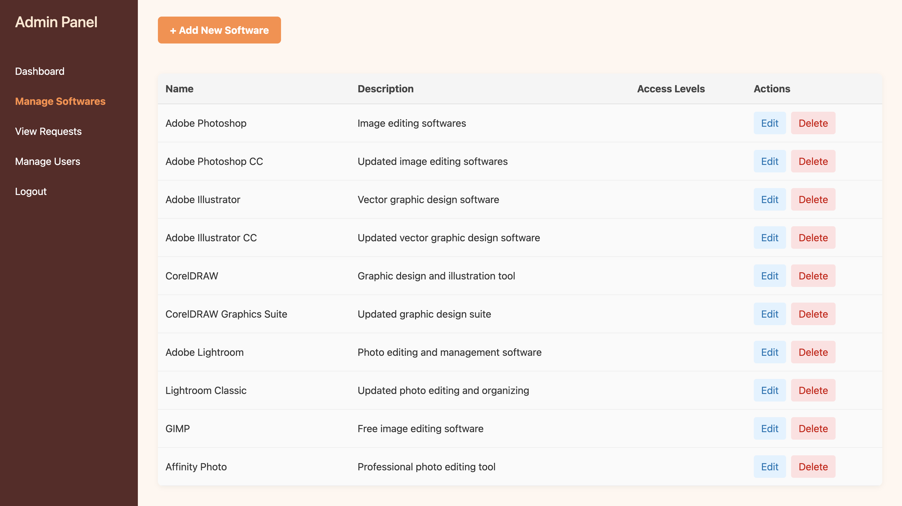
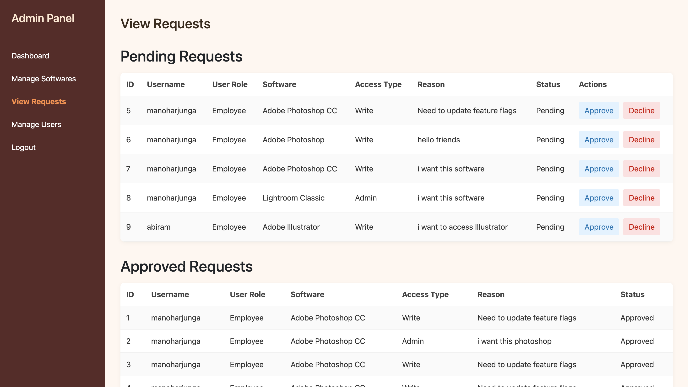
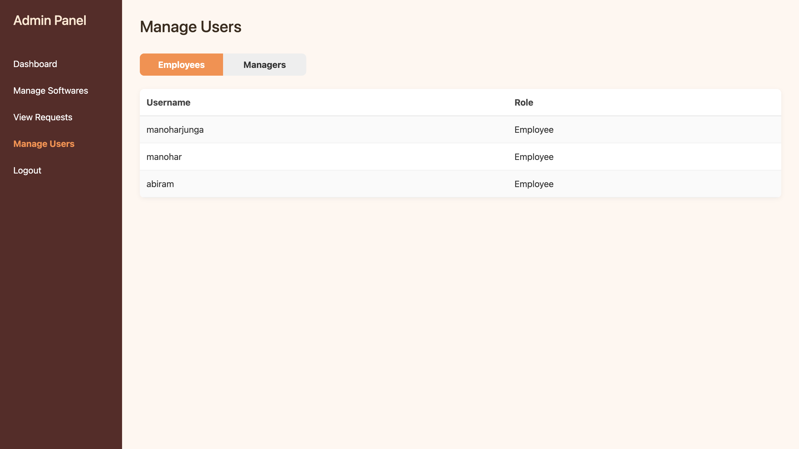
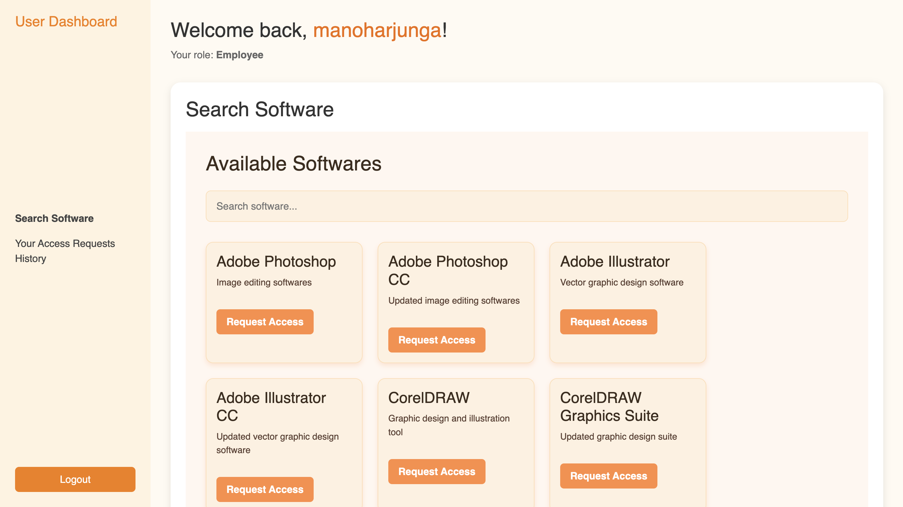
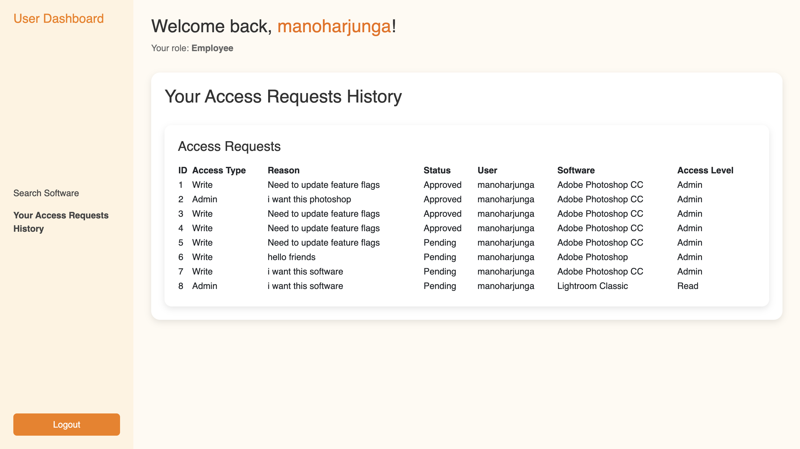

# 🔐 User Access Management System

## 📌 Project Overview

I built this **User Access Management System** to handle user authentication, role-based access, and dynamic software access request workflows. It includes:

- 🧑‍💼 Employees who can request access
- 🧑‍💼 Managers who can approve/reject
- 👨‍💼 Admins who can manage software

Built with a **MERN-like stack** (React + Node.js + PostgreSQL), it uses **TypeORM**, **JWT**, and **Axios** for seamless full-stack integration.

---

## ⚙️ Technologies Used

| Layer     | Stack                              |
|-----------|------------------------------------|
| Frontend  | React + Vite + Axios               |
| Backend   | Node.js + Express.js               |
| Database  | PostgreSQL                         |
| ORM       | TypeORM                            |
| Auth      | JWT + bcrypt                       |

---
Here’s how you can rewrite the **"Axios API Abstraction"** and **"Environment Setup"** sections of your `README.md` to reflect each API **as a logical endpoint with operation details**, and clearly describe what each API does, like actual RESTful API documentation.

---

## 🔁 API Endpoints & Operations

All frontend-to-backend communication is done using `axios` with authentication headers automatically injected using `localStorage` token. Here's a breakdown of the **API structure** and **operations**.

---

### 🔐 Auth APIs

| Method | Endpoint       | Description                      | Auth Required |
| ------ | -------------- | -------------------------------- | ------------- |
| POST   | `/auth/signup` | Register a new user              | ❌             |
| POST   | `/auth/login`  | Authenticate a user & return JWT | ❌             |


### 💻 Software APIs

| Method | Endpoint        | Description                | Auth Required |
| ------ | --------------- | -------------------------- | ------------- |
| GET    | `/software`     | Fetch all software entries | ✅             |
| POST   | `/software`     | Create new software        | ✅ (Admin)     |
| PUT    | `/software/:id` | Update software by ID      | ✅ (Admin)     |
| DELETE | `/software/:id` | Delete software by ID      | ✅ (Admin)     |

---

### 👥 User Management APIs

| Method | Endpoint           | Description                        | Auth Required |
| ------ | ------------------ | ---------------------------------- | ------------- |
| GET    | `/users/employees` | Get all users with role "employee" | ✅             |
| GET    | `/users/managers`  | Get all users with role "manager"  | ✅             |

---
```
PORT=3001
DATABASE_URL=postgre_url
JWT_SECRET=your_secret_code

```

### `.env` for Frontend

```
VITE_API_BASE=http://localhost:3001/api
```

---

## 🧠 Features Overview

| Feature                 | Employee | Manager | Admin |
| ----------------------- | -------- | ------- | ----- |
| Signup/Login            | ✅        | ✅       | ✅     |
| Software List           | ✅        | ✅       | ✅     |
| Request Access          | ✅        | ❌       | ✅     |
| View Pending Requests   | ❌        | ✅       | ✅     |
| Approve/Reject Requests | ❌        | ✅       | ✅     |
| Create/Edit Software    | ❌        | ❌       | ✅     |

---

## 🚀 Getting Started

### Backend

```bash
cd backend
npm install
npm run typeorm migration:run
npm run dev
```

### Frontend

```bash
cd frontend
npm install
npm run dev
```

---

## 📷 UI Screenshots

| Screen                   | Description               |
| ------------------------ | ------------------------- |
|  | Login Page                |
|  | Signup Page               |
|  | Admin - Create Software   |
|  | Employee - Request Access |
|  | Manager - Review Requests |

---

## 📝 Final Notes

This project was a great exercise in managing **authentication, authorization, CRUD operations**, and **frontend-backend communication** using clean Axios wrappers. Let me know your thoughts or if you'd like to contribute!

```
